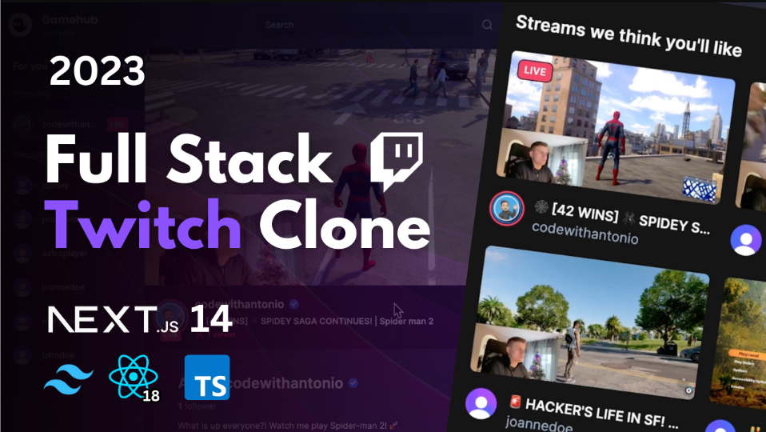

[![Facebook-Page][facebook-shield]][facebook-url]
[![Twitter][twitter-shield]][twitter-url]
[![Instagram][instagram-shield]][instagram-url]
[![LinkedIn][linkedin-shield]][linkedin-url]

  <h1 align="center">Gamehub</h1>
  
<h3>Project Link: <a href="https://github.com/dyaipayan22/gamehub">GitHub</a></h3>

### Fullstack Twitch Clone: Next.js 14, Live streaming, React, Prisma, Tailwind, MongoDB

<!-- TABLE OF CONTENTS -->

## Table of Contents

- [Key Features](#key-features)
- [Prerequisites](#prerequisites)
- [Start the app](#start-the-app)
- [How to setup the initial project](#how-to-setup-the-initial-project)
- [Contact](#contact)

This is a repository for Fullstack Trello Clone: Next.js 14, Livestreaming, React, Prisma, Tailwind, MongoDB.

### Features:

- 📡 Streaming using RTMP / WHIP protocols
- 🌐 Generating ingress
- 🔗 Connecting Next.js app to OBS / Your favorite streaming software
- 🔐 Authentication
- 📸 Thumbnail upload
- 👀 Live viewer count
- 🚦 Live statuses
- 💬 Real-time chat using sockets
- 🎨 Unique color for each viewer in chat
- 👥 Following system
- 🚫 Blocking system
- 👢 Kicking participants from a stream in real-time
- 🎛️ Streamer / Creator Dashboard
- 🐢 Slow chat mode
- 🔒 Followers only chat mode
- 📴 Enable / Disable chat
- 🔽 Collapsible layout (hide sidebars, chat etc, theatre mode etc.)
- 📚 Sidebar following & recommendations tab
- 🏠 Home page recommending streams, sorted by live first
- 🔍 Search results page with a different layout
- 🔄 Syncing user information to our DB using Webhooks
- 📡 Syncing live status information to our DB using Webhooks
- 🤝 Community tab
- 🎨 Beautiful design
- ⚡ Blazing fast application
- 📄 SSR (Server-Side Rendering)
- 🗺️ Grouped routes & layouts
- 🗃️ MongoDB
- 🚀 Deployment
